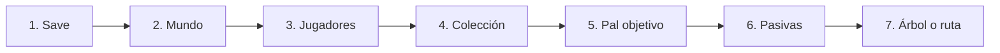

# Guía de uso y formatos

Esta guía describe cómo instalar y usar **Palworld Breeding Path** en una sola computadora, qué
información obtiene del guardado y los formatos JSON internos que utiliza. La aplicación es una
reconstrucción independiente inspirada en el flujo de PalBreed; no necesita una cuenta ni un
servidor de datos.

## Contenido

- [Instalación local](#instalación-local)
- [Flujo visual completo](#flujo-visual-completo)
- [Privacidad y almacenamiento](#privacidad-y-almacenamiento)
- [Formatos de guardado y limitaciones](#formatos-de-guardado-y-limitaciones)
- [Esquema JSON de una colección](#esquema-json-de-una-colección)
- [Esquema JSON de pasivas bilingües](#esquema-json-de-pasivas-bilingües)
- [Estructura del proyecto](#estructura-del-proyecto)
- [Comandos](#comandos)

## Instalación local

### Requisitos

- Windows 10 u 11.
- Node.js 20 LTS recomendado, con `npm` incluido.
- Chrome o Edge reciente. El selector de carpetas y la descompresión `PlZ` dependen de funciones
  modernas del navegador.
- Una copia local de este proyecto.

### Inicio rápido en Windows

1. Abre la carpeta del proyecto.
2. Haz doble clic en `start-local.cmd`.
3. La primera ejecución instalará las dependencias con `npm install`.
4. Abre <http://127.0.0.1:5199> si el navegador no se abre automáticamente.

El servidor de desarrollo está configurado para escuchar únicamente en `127.0.0.1`. Debes dejar
abierta la ventana de la terminal mientras uses la aplicación. Para detenerlo, presiona `Ctrl+C`.

### Inicio desde PowerShell

```powershell
cd C:\Workstation\Palworld\pal-breeding-path
npm ci
npm run dev
```

`npm ci` reproduce exactamente las versiones registradas en `package-lock.json`. Si estás
desarrollando y quieres actualizar el archivo de bloqueo, usa `npm install`.

## Flujo visual completo

La secuencia de trabajo está pensada como un asistente de siete apartados:



### 1. Cargar el save

Pulsa la tarjeta **Elige origen**, abre la pestaña **Importar save** y usa una de estas opciones:

- **Elegir carpeta SaveGames**: selecciona la carpeta completa
  `%LOCALAPPDATA%\Pal\Saved\SaveGames`. Es la opción recomendada porque permite encontrar los
  distintos mundos sin entrar manualmente en cada subcarpeta.
- **Elegir Level.sav**: abre directamente un archivo `Level.sav`. Es útil para una copia de
  seguridad o un guardado ubicado fuera de la ruta normal.

Al usar el selector de Windows puedes pegar la ruta anterior en la barra de ubicación, presionar
`Enter` y confirmar **SaveGames**. Las carpetas llamadas `backup` se omiten para evitar duplicados.

Durante la lectura aparecen estados como **Leyendo los archivos del mundo**, **Descomprimiendo el
mundo** y **Leyendo los datos del mundo**. No cierres la pestaña hasta que termine.

### 2. Elegir el mundo

Si la carpeta contiene más de un `Level.sav`, se muestra una tabla de mundos. Los candidatos se
ordenan primero por la fecha de modificación más reciente. Marca el mundo que corresponda a tu
partida y pulsa **Elegir jugadores**.

Para construir cada fila, el lector agrupa los archivos que pertenecen a la misma carpeta de mundo:

- `Level.sav` aporta los personajes, Pals, grupos y contenedores del mundo;
- `LevelMeta.sav` aporta `WorldName`, `HostPlayerName`, `HostPlayerLevel`, `InGameDay` y la marca de
  tiempo;
- `WorldOption.sav` aporta `OptionWorldData.Settings.bIsMultiplay` para indicar si es multijugador;
- `Players/<PlayerUId>.sav` aporta los identificadores de jugador y de sus contenedores;
- `Players/<PlayerUId>_dps.sav` aporta su almacenamiento dimensional.

Así, la tabla puede mostrar el nombre y la fecha del mundo, día de partida, anfitrión, nivel y estado
multijugador. Si falta un archivo auxiliar, la app conserva el mundo en la lista y muestra `—` o un
valor alternativo para el dato que no pudo obtener.

### 3. Elegir jugadores

En un mundo multijugador, marca uno o varios jugadores. Cada fila muestra nombre, nivel y cantidad de
Pals atribuida. **Seleccionar todos** marca la lista completa y **Limpiar** quita la selección. El
botón final indica cuántos Pals se importarán.

La asociación se realiza de esta forma:

1. `PlayerUId` identifica al jugador.
2. `PalStorageContainerId` identifica su Palbox.
3. `OtomoCharacterContainerId` identifica su equipo.
4. Esos valores se cruzan con `SlotId.ContainerId` y `OwnerPlayerUId` de cada Pal en `Level.sav`.
5. Solo se conservan los Pals pertenecientes a los jugadores seleccionados.

Los archivos `Players/<PlayerUId>_dps.sav` se detectan por el sufijo `_dps.sav` y se cargan
automáticamente. Los ejemplares dimensionales compartidos que no tienen propietario se añaden una
sola vez siempre que se importe al menos un jugador; el contador se muestra por separado. Un Pal de
base u otro contenedor se incluye cuando conserva un `OwnerPlayerUId` seleccionado. Los Pals de base
sin propietario verificable se excluyen para evitar atribuirlos al jugador equivocado.

Si no hay perfiles separables pero sí datos del anfitrión, la pantalla ofrece **Colección completa**
como una única selección.

### 4. Revisar la colección importada

Cuando termina la lectura, la tarjeta de origen indica cuántos Pals se importaron. El panel de
colección muestra:

- especie y apodo;
- nivel;
- sexo (`♂`, `♀` o desconocido);
- ubicación: Palbox, equipo, almacenamiento dimensional, base/otro o desconocida;
- pasivas;
- IV de HP, ataque y defensa;
- favorito y condición alfa/jefe, cuando están disponibles.

La cabecera resume ejemplares, especies distintas, sexos y pasivas únicas. Si el juego contiene una
especie que todavía no existe en `src/data/pals.json`, la app la omite y muestra una advertencia.

Los botones disponibles son:

- **Actualizar carpeta**: vuelve a leer `SaveGames` para sustituir la colección activa.
- **Otro Level.sav**: importa un archivo concreto.
- **Quitar**: elimina la colección normalizada del navegador. No toca el save original.

### 5. Seleccionar el Pal objetivo

Pulsa la tarjeta **Elegir objetivo**. Puedes recorrer la lista completa de especies criables o
buscar por nombre. Al seleccionar una especie, el planificador empieza a calcular con los
ejemplares exactos de la colección.

El objetivo describe la **especie final**, no un ejemplar ya existente. Si ya posees un Pal de esa
especie con todas las pasivas solicitadas, el resultado será **Ya lo tienes** y requerirá cero
cruces.

### 6. Seleccionar pasivas

Pulsa **Añadir pasivas** para abrir el selector. La lista contiene solamente pasivas presentes en
algún Pal de la colección activa.

1. Busca por el nombre en español o inglés.
2. Selecciona hasta cuatro pasivas.
3. Usa **Limpiar** si quieres empezar de nuevo.
4. Confirma con **Hecho**.

El contador `0/4` indica cuántas pasivas se eligieron. Los colores y rangos ayudan a reconocer su
categoría, pero el identificador interno es el dato utilizado en el cálculo.

La herencia no es determinista. La ruta supone que repetirás cada cruce —y que usarás el método de
crianza configurado, como el pastel especial indicado por la interfaz— hasta conseguir un hijo del
sexo requerido que conserve las pasivas marcadas. Las pasivas no deseadas se muestran como
competidoras cuando pueden reducir la limpieza del resultado.

### 7. Leer la ruta o el árbol

La vista **Ruta de crianza** presenta cada operación como:

```text
progenitor A + progenitor B → hijo
```

La vista **Árbol de crianza** coloca el objetivo arriba y sus progenitores debajo, unidos por
conectores. Las etiquetas significan:

- **PROPIO**: ejemplar exacto que ya está en el save.
- **CRIAR PRIMERO**: ejemplar intermedio que debes obtener antes de continuar.
- **OBJETIVO**: Pal final solicitado.

La gráfica es interactiva: arrastra cualquier zona vacía con el botón izquierdo para moverla, usa
la rueda del mouse o los botones `−` y `+` para cambiar el zoom, y pulsa **Centrar** para ajustar y
volver a colocar el árbol completo dentro del lienzo. Con teclado, las flechas desplazan la gráfica,
`+`/`-` cambian el zoom y `0` vuelve a centrarla.

El símbolo de sexo forma parte de la instrucción. Un ejemplar de la especie correcta pero del sexo
opuesto no sustituye automáticamente al indicado. Las pasivas que aparecen en una tarjeta son las
que esa rama debe transportar.

**Guardar ruta** conserva la configuración localmente. Al cargarla de nuevo, una ruta creada desde
un save solo se habilita si coincide con la colección activa; el plan se vuelve a calcular y no
guarda una copia completa del archivo original.

## Privacidad y almacenamiento

La lectura del mundo ocurre en un Web Worker del navegador. El flujo normal no sube `Level.sav`,
`LevelMeta.sav`, `WorldOption.sav`, archivos de `Players/` ni la colección resultante; tampoco envía
datos a una API ni necesita iniciar sesión.

La aplicación guarda localmente:

- la colección normalizada activa, en IndexedDB, base `pal-breeding-path`, almacén `collections`;
- idioma, modo, objetivo, pasivas personalizadas y rutas guardadas, en `localStorage`;
- ningún byte de los archivos `.sav` originales después de completar el análisis.

Consideraciones importantes:

- `npm install` o `npm ci` sí se conecta al registro de npm para descargar dependencias. Esto ocurre
  durante la instalación, no al analizar un save.
- El script de mantenimiento `tools/refresh-data.mjs` sí consulta `palbreed.com` de forma explícita.
- Borrar datos del sitio en el navegador elimina la colección y las rutas locales.
- **Quitar** elimina la colección normalizada de IndexedDB, pero nunca modifica ni borra los archivos
  de Palworld.
- Si compartes manualmente un JSON o una captura, revisa antes apodos, rutas y demás datos que puedan
  identificar tu partida.

## Formatos de guardado y limitaciones

### Compatibles

| Formato | Estado | Notas |
| --- | --- | --- |
| `PlM1` | Compatible | Contenedor moderno Oodle/Kraken; se descomprime localmente con `ooz-wasm`. |
| `PlZ1` | Compatible | Una capa `deflate`; requiere `DecompressionStream`. |
| `PlZ2` | Compatible | Dos capas `deflate`; requiere `DecompressionStream`. |
| `GVAS` | Compatible | Guardado ya descomprimido que contenga `worldSaveData`. |
| `CNK` | No compatible | Contenedor usado por determinados guardados de Xbox. |

El selector de archivo acepta `.sav`, pero el contenido debe corresponder a un `Level.sav` válido.
Un `Players/<id>.sav` aislado no contiene la estructura de mundo que espera esa opción. Para obtener
mundos, jugadores y almacenamiento dimensional debes seleccionar la carpeta **SaveGames** completa
y conservar la estructura de nombres original.

### Límites de seguridad y tiempo

- Tamaño máximo de cada archivo leído: **512 MiB**.
- Tamaño descomprimido declarado máximo: **1 GiB**.
- Tiempo máximo de análisis en el Worker: **120 segundos**.
- Las carpetas `backup` se ignoran al buscar mundos.
- Solo se reconocen perfiles `Players/<32 caracteres hexadecimales>.sav` y almacenes dimensionales
  `Players/<32 caracteres hexadecimales>_dps.sav`.
- Si cargas `Level.sav` directamente, se crea una colección global sin `world`, `players`,
  `selectedPlayerIds`, `sharedPalCount` ni los Pals guardados en archivos `_dps.sav`.
- En el flujo de carpeta, los Pals de base/otros contenedores sin `OwnerPlayerUId` se excluyen. Los
  que sí tienen un propietario seleccionado se conservan.
- Un guardado incompleto, una cabecera desconocida o memoria insuficiente detienen la importación sin
  sustituir la colección anterior.

### Límites del cálculo

- Se requieren sexos conocidos y compatibles (`M` + `F`) para los cruces importados.
- Se pueden solicitar como máximo cuatro pasivas y todas deben existir en la colección.
- La especie y la compatibilidad del plan son deterministas; el sexo real del huevo y la herencia de
  pasivas son probabilísticos.
- Los IV se usan como criterio secundario para elegir entre estados equivalentes, pero no se pueden
  solicitar valores mínimos ni garantizar su herencia.
- La búsqueda tiene presupuestos internos de estados y parejas. Una combinación muy amplia puede
  terminar con un aviso para reducir el número de pasivas.
- La atribución depende de los identificadores guardados por Palworld. Un archivo auxiliar ausente o
  un propietario vacío puede reducir el conteo, pero no provoca que un Pal se asigne a otra persona.
- El modo **Seleccionar manualmente** trabaja solo con especies marcadas. No resuelve individuos,
  sexo, apodos, IV ni pasivas.
- Los cambios de formato de Pocketpair pueden requerir actualizar el parser y la base de datos.

## Esquema JSON de una colección

La colección es el objeto normalizado que se almacena en IndexedDB y se entrega al planificador. No
es una copia del save y la interfaz actual no ofrece un botón para importar este JSON directamente.
El esquema persistido vigente es la versión `2`; el importador produce internamente una versión `1`
equivalente y `App.jsx` la normaliza antes de guardarla.

Ejemplo reducido:

```json
{
  "schemaVersion": 2,
  "importedAt": 1785625200000,
  "format": "PlM1",
  "source": {
    "name": "Level.sav",
    "relativePath": "SaveGames/123456789/ABCDEF/Level.sav",
    "size": 73400320,
    "lastModified": 1785625100000
  },
  "world": {
    "id": "0123456789abcdef0123456789abcdef",
    "name": "Islas Palpagos",
    "timestampTicks": 639028557000000000,
    "timestamp": "2026-08-01T17:15:00.000",
    "day": 181,
    "hostPlayerName": "Uriel",
    "hostPlayerLevel": 80,
    "multiplayer": true,
    "format": "PlM1",
    "relativePath": "SaveGames/123456789/0123456789abcdef0123456789abcdef/Level.sav",
    "lastModified": 1785625100000
  },
  "players": [
    {
      "id": "aaaaaaaaaaaaaaaaaaaaaaaaaaaaaaaa",
      "name": "Uriel",
      "level": 80,
      "palCount": 359,
      "palboxContainerId": "cccccccccccccccccccccccccccccccc",
      "partyContainerId": "dddddddddddddddddddddddddddddddd",
      "lastOnlineTicks": null,
      "platform": "Steam",
      "groupId": "bbbbbbbbbbbbbbbbbbbbbbbbbbbbbbbb",
      "isHost": true
    }
  ],
  "selectedPlayerIds": ["aaaaaaaaaaaaaaaaaaaaaaaaaaaaaaaa"],
  "sharedPalCount": 12,
  "instances": [
    {
      "instanceId": "3f03...:17:0",
      "palId": "anubis",
      "speciesCode": "Anubis",
      "name": "Anubis",
      "nickname": "Constructor",
      "gender": "M",
      "level": 55,
      "passiveIds": ["CraftSpeed_up2", "MoveSpeed_up_3"],
      "passives": ["Artisan", "Swift"],
      "location": "palbox",
      "containerId": "3f03...",
      "slotIndex": 17,
      "ownerPlayerUid": "aaaaaaaaaaaaaaaaaaaaaaaaaaaaaaaa",
      "groupId": "bbbbbbbbbbbbbbbbbbbbbbbbbbbbbbbb",
      "favorite": true,
      "alphaOrBoss": false,
      "ivs": {
        "hp": 91,
        "attack": 84,
        "defense": 88
      }
    }
  ],
  "speciesIds": ["anubis"],
  "warnings": {
    "skippedEmpty": 0,
    "skippedParse": 0,
    "unmatchedCodes": {},
    "unmatchedTotal": 0
  }
}
```

### Campos principales

| Campo | Tipo | Descripción |
| --- | --- | --- |
| `schemaVersion` | número | Versión del objeto normalizado, no del save de Palworld. |
| `importedAt` | número | Fecha de importación en milisegundos Unix. |
| `format` | texto | Formato detectado: por ejemplo `PlM1`, `PlZ1`, `PlZ2` o `GVAS`. |
| `source` | objeto | Metadatos mínimos del archivo; no contiene sus bytes. |
| `world` | objeto | Metadatos normalizados de `LevelMeta.sav`, `WorldOption.sav` y `Level.sav`. No existe al importar un archivo aislado. |
| `players` | arreglo | Jugadores seleccionados y sus contenedores conocidos. |
| `selectedPlayerIds` | arreglo | `PlayerUId` elegidos en el asistente. |
| `sharedPalCount` | número | Pals dimensionales compartidos, sin propietario, incluidos automáticamente. |
| `instances` | arreglo | Ejemplares exactos utilizables por el planificador. |
| `speciesIds` | arreglo | Identificadores únicos de especies presentes. |
| `warnings` | objeto | Registros omitidos o códigos sin correspondencia local. |

### Campos de `instances[]`

| Campo | Tipo | Descripción |
| --- | --- | --- |
| `instanceId` | texto | `InstanceId` (GUID) del registro del save cuando está presente; si falta, se deriva localmente como `contenedor:slot:índice` de lectura. |
| `palId` | texto | Clave de especie usada por `src/data/pals.json` y el motor. |
| `speciesCode` | texto | Código interno de Palworld. |
| `name` | texto | Nombre base conocido por la base local. |
| `nickname` | texto o `null` | Apodo del ejemplar. |
| `gender` | `M`, `F` o `""` | Sexo normalizado; vacío significa desconocido. |
| `level` | número o `null` | Nivel leído del save. |
| `passiveIds` | arreglo | Identificadores internos; son la fuente de verdad para buscar y planificar. |
| `passives` | arreglo | Nombres obtenidos durante el parseo; se conservan como referencia. |
| `location` | texto | `palbox`, `party`, `dimensional`, `base-or-other` o `unknown`. |
| `containerId` | texto o `null` | Contenedor de Palworld del que salió el registro. |
| `slotIndex` | número o `null` | Posición dentro del contenedor. |
| `ownerPlayerUid` | texto o `null` | `PlayerUId` al que pertenece; `null` en almacenamiento dimensional compartido. |
| `groupId` | texto o `null` | Grupo o gremio registrado por Palworld, cuando existe. |
| `favorite` | booleano | Marca de favorito, si existe. |
| `alphaOrBoss` | booleano | Indica prefijo alfa/jefe reconocido. |
| `ivs` | objeto | Valores normalizados `hp`, `attack` y `defense`; pueden ser `null`. |

No edites una colección directamente en IndexedDB mientras la app está abierta. El planificador y
las rutas guardadas suponen que `palId`, `gender`, `passiveIds` e `instanceId` son coherentes.

### Campos de `world`

| Campo | Descripción |
| --- | --- |
| `id` | Nombre de la carpeta/identificador del mundo. |
| `name` | `WorldName` de `LevelMeta.sav`, con el identificador de carpeta como alternativa. |
| `timestampTicks` / `timestamp` | Fecha original de Palworld y versión ISO local sin conversión de zona horaria. |
| `day` | Día de juego (`InGameDay`). |
| `hostPlayerName` / `hostPlayerLevel` | Nombre y nivel del anfitrión. |
| `multiplayer` | Valor booleano de `bIsMultiplay`. |
| `format` | Formato detectado de `Level.sav`. |
| `relativePath` / `lastModified` | Procedencia local y fecha del archivo principal. |

### Campos de `players[]`

| Campo | Descripción |
| --- | --- |
| `id` | `PlayerUId` normalizado. |
| `name` / `level` | Datos del personaje encontrados en `Level.sav`. |
| `palCount` | Cantidad de Pals atribuida antes de sumar los dimensionales compartidos. |
| `palboxContainerId` | `PalStorageContainerId` del perfil. |
| `partyContainerId` | `OtomoCharacterContainerId` del perfil. |
| `lastOnlineTicks` / `platform` | Metadatos opcionales del archivo de jugador. |
| `groupId` | Identificador de grupo/gremio cuando está disponible. |
| `isHost` | Indica si coincide con el anfitrión del mundo. |

## Esquema JSON de pasivas bilingües

La app incluye `src/data/passives_i18n.json`. Además, el modal de pasivas permite cargar un archivo
personalizado que sustituye textos por `id` sin modificar el save ni el catálogo incorporado.

Formato recomendado:

```json
{
  "passives": [
    {
      "id": "CraftSpeed_up2",
      "en": "Artisan",
      "es": "Maestría",
      "esMX": "Espíritu artesano",
      "descriptionEn": "Work Speed +50%",
      "descriptionEs": "Velocidad de trabajo +50%",
      "descriptionEsMX": "Velocidad de trabajo +50%",
      "rank": 3
    }
  ]
}
```

### Reglas

- `id` es obligatorio y debe coincidir exactamente con `passiveIds` del save. Cambiar mayúsculas,
  guiones bajos o sufijos crea otro identificador y no traducirá la pasiva existente.
- `en` es el nombre inglés.
- `es` es el nombre de español general.
- `esMX` es la variante de español de México. La interfaz en español prefiere `esMX`, después `es` y
  finalmente `en`.
- `descriptionEn`, `descriptionEs` y `descriptionEsMX` son opcionales.
- `rank` es numérico; puede ser negativo, cero o positivo. Controla la presentación visual, no el
  resultado genético.
- Los campos ausentes heredan el valor del catálogo incorporado cuando existe el mismo `id`.
- Las entradas repetidas dentro del mismo archivo se ignoran después de la primera.
- Las personalizaciones válidas se combinan con las anteriores y permanecen en `localStorage`.

También se admite un arreglo directo o un objeto indexado por identificador, pero el contenedor
`{"passives": [...]}` es el formato recomendado y más fácil de versionar. Hay un archivo completo de
ejemplo en `examples/passives.custom.example.json`.

El catálogo incorporado añade estos metadatos de procedencia:

```json
{
  "schemaVersion": 1,
  "source": "tylercamp/palcalc",
  "sourceVersion": "v27",
  "passives": []
}
```

Cada entrada incorporada también puede contener `randomInheritanceAllowed`. Ese campo procede de la
base de datos de origen; actualmente el planificador no lo utiliza para calcular probabilidades.

## Estructura del proyecto

| Ruta | Responsabilidad |
| --- | --- |
| `src/App.jsx` | Estado principal, persistencia de preferencias y coordinación entre importador, selectores y resultados. |
| `src/components/` | Interfaz: carga, colección, objetivo, pasivas, ayuda, ruta, árbol y planes guardados. |
| `src/i18n.js` | Idiomas admitidos, textos de la guía integrada y utilidades de traducción. |
| `src/data/pals.json` | Especies, rangos, combinaciones e iconos asociados. |
| `src/data/passives_i18n.json` | Catálogo incorporado de nombres y descripciones bilingües. |
| `src/data/passiveCatalog.js` | Normalización, búsqueda, traducciones personalizadas y estilos por rango. |
| `src/data/passive_names.json` | Mapa de identificadores internos de pasivas a su nombre en inglés; el lector del save lo usa para llenar `passives`. |
| `src/engine/breeding.js` | Reglas por especie y cálculo del hijo de cada pareja. |
| `src/engine/collectionPlanner.js` | Búsqueda por ejemplar exacto, sexo y máscara de hasta cuatro pasivas. |
| `src/engine/planner.worker.js` | Ejecuta el planificador sin bloquear la interfaz. |
| `src/engine/plannerClient.js` | Crea el Worker del planificador por solicitud y gestiona progreso, errores y cancelación. |
| `src/import/gvasParser.js` | Lector binario de las propiedades necesarias de `worldSaveData`. |
| `src/import/saveDecompress.js` | Detección y descompresión de `GVAS`, `PlM` y `PlZ`. |
| `src/import/importPalworldSave.js` | Normaliza las filas del parser en la colección: mundo, jugadores, ubicación por contenedor, propietarios y dimensionales compartidos. |
| `src/import/save.worker.js` | Analiza el save fuera del hilo principal. |
| `src/import/workerClient.js` | Prepara los archivos, aplica los límites de 512 MiB y 120 segundos y ejecuta `save.worker.js` con mensajes de progreso. |
| `src/import/findSaveCandidates.js` | Encuentra cada `Level.sav` de la carpeta elegida y agrupa sus `LevelMeta.sav`, `WorldOption.sav` y archivos de `Players/`, omitiendo `backup`. |
| `src/import/collectionStore.js` | Guarda o elimina la colección activa en IndexedDB. |
| `src/vendor/` | Dependencias incorporadas para descompresión. |
| `public/pals/` | Imágenes locales de especies. |
| `examples/` | Ejemplos de archivos que puede preparar el usuario. |
| `tools/` | Scripts de mantenimiento de datos; no se ejecutan durante el uso normal. |
| `LICENSES/` | Textos de licencias de componentes de terceros. |
| `start-local.cmd` | Inicio sencillo en Windows. |

## Comandos

Ejecuta los comandos desde la raíz del proyecto.

| Comando | Uso |
| --- | --- |
| `npm ci` | Instala exactamente las dependencias de `package-lock.json`. |
| `npm install` | Instala dependencias y permite actualizar el archivo de bloqueo. |
| `npm run dev` | Inicia Vite en `http://127.0.0.1:5199`. |
| `npm run build` | Genera una compilación de producción en `dist/`. |
| `npm run preview` | Sirve localmente la compilación ya generada para revisarla. |
| `npm audit` | Revisa vulnerabilidades conocidas de dependencias npm. |
| `node tools/refresh-data.mjs` | Actualiza datos e iconos desde PalBreed; requiere Internet y es solo para mantenimiento. |
| `node tools/build-passive-catalog.mjs <ruta-a-db.json>` | Regenera `passives_i18n.json` desde una base local compatible de PalCalc. |

El proyecto no define por ahora scripts `test` ni `lint`. La comprobación mínima antes de entregar
cambios es ejecutar `npm run build` y revisar manualmente el flujo de importación en Chrome o Edge.
